## Stable and bias-free Monte Carlo Greeks <small>using finite differences (FD) and (adjoint)-automatic differentiation (AAD)</small>

In the realm of financial derivatives, accurate and stable computation of sensitivities of option prices to various parameters — is crucial for effective risk management and trading strategies. This becomes particularly challenging when dealing with Monte Carlo simulations, especially for options with discontinuous payoffs (digital, barrier, etc.).

In recent years, (adjoint)-automatic differentiation (AAD) has gained significant popularity for computing sensitivities, or Greeks, of financial derivatives. This method promises higher efficiency and accuracy compared to traditional finite difference (FD) approaches. Meanwhile, finite differences are still widely used in many established pricing systems, often employing the bump-and-reval technique to obtain Greeks. However, when applied to Monte Carlo simulations, particularly for options with discontinuous payoffs, both methods have their own sets of challenges and intricacies.

Within this repo, I will explore two main topics. First, I will investigate how to develop a method for post-processing AAD recordings using the concept of adding a stochastic node. Second, I will examine how to create new Monte Carlo estimators that provide stable finite difference (FD) and bias-free AAD Greeks, at least up to the second order. I will refer to these as Bias-Free Stable (BFS) Monte Carlo estimators.

I will begin by presenting various examples that illustrate stability and bias issues with both FD and AAD methods. This includes a motivational example where we study the issues of both methods when naively using the standard Monte Carlo estimator for simple digital options. These examples will set the stage for the subsequent discussion on the novel approaches.

Before jumping into the introductury examples, let me refer to the monograph ["Quantitative Finance: Back to Basic Principles"](https://books.google.de/books?hl=en&lr=&id=rLsxBgAAQBAJ&oi=fnd&pg=PP1&ots=1wmraZ3t1W&sig=K-irQaky7v9VS-5QWLFuj5EjROQ&redir_esc=y#v=onepage&q&f=false) by Adil Reghai. In chapter 3, the author describes (coming from a PnL point of view) the validity of the Black & Scholes model for different instruments. While the chapter concludes that for some instruments (e.g. European Call options) the Black & Scholes is appropriate, I'll nevertheless study Monte Carlo estimator for these payoffs, since components of these are often also used within more complex instruments (for which a Monte Carlo estimator might be required).

## 0. Introductary Example: Digital call options: biased and instable Greeks using standard Monte Carlo

Consider the Black-Scholes model and a digital asset or nothing (up-and-in) option (closed solution available). Furthermore, consider a naive Monte Carlo simulation to compute the present value of this option.  

Please check the code given in the [Colab notebook](https://github.com/da-roth/StableAndBiasFreeMonteCarloGreeks/blob/main/src/Examples_Introduction/introductory_example_Colab.ipynb) to reproduce the results of the following images and for the used model and simulation parameters. This notebook and the ones that will follow use PyTorch as the underlying AAD framework.

### Present value comparison

 First, let us compare the present value obtained via the standard naive Monte Carlo estimator (100k samples) and the closed-form solution:

 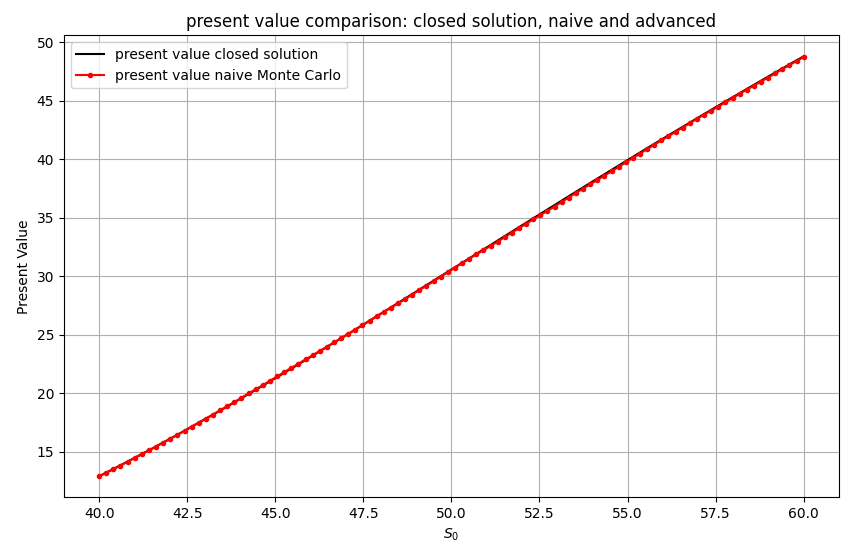

 Normally, one might want to study convergence, but for the purpose of this investigations, I'll here simply perceive that the standard Monte Carlo estimator produces viable results for different initial spot values S.

### Delta comparison

 In the next figure, we'll take a look at the Deltas computed through FD and AAD and compare them to the exact result: 

 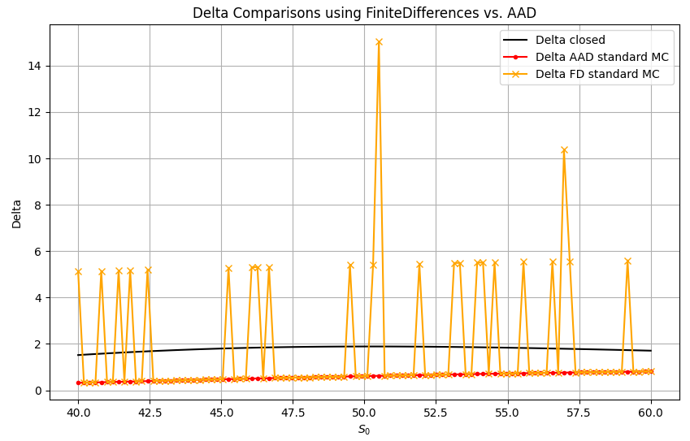

 The naive Monte Carlo approach shows the typical instabilities of Monte Carlo simulation for discontinuous payoff, the AAD applied to the naive approach does not suffer from instability, however its results are biased.

## 1. Introduction

Let me highlight the key contributions from the literature that have motivated my investigations into stable and bias-free Greeks computations using Monte Carlo methods. These articles cover fzundational concepts, innovative techniques, and advancements in the stability of differentiation and sensitivity calculations for financial derivatives. While each paper contains a broad array of content, the following key points are especially pertinent to the focus of this page:

- ["A Monte Carlo pricing algorithm for autocallables that allows for stable differentiation."](https://www.math.uni-frankfurt.de/~harrach/publications/StableDiffs.pdf) by Alm et al.. In this work, section 2.3 formulates a definition of when a Monte Carlo estimator allows for stable differentiation through finite differences (FD). Additionally, the authors provide a theorem proving stability under specific assumptions.
- ["Monte Carlo pathwise sensitivities for barrier options"](https://www.risk.net/journal-of-computational-finance/7533966/monte-carlo-pathwise-sensitivities-for-barrier-options) by my co-authors and me, introduces a transformation of the barrier option's payoff, enabling stable finite differences. We developed a framework that computes pathwise sensitivities successively, effectively replacing finite differences. [Algorithm 1](https://www.math.uni-frankfurt.de/~harrach/publications/pathwise.pdf) on page 9 of the article's preprint clearly illustrates the connection to ['forward accumulation'](https://en.wikipedia.org/wiki/Automatic_differentiation#Forward_and_reverse_accumulation) in autmatic differentiation.
- ["Convergence of Milstein Brownian bridge Monte Carlo methods and stable Greeks calculation"](https://arxiv.org/abs/1906.11002) extends our previous work to continuously-monitored barrier options and relaxes model assumptions from Black-Scholes to local volatility models. We address the instability of the well-studied and commonly used Brownian bridge approach for second-order Greeks in barrier options. Our proposed Monte Carlo estimator, which combines the Brownian bridge approach with the concept of  ['Conditioning on one-step survival for barrier option simulations'](https://pubsonline.informs.org/doi/abs/10.1287/opre.49.6.923.10018) by Glasserman and Staum, allows for stable second-order Greeks. To complete the mathematical foundation, we formulated a definition on when a Monte Carlo estimator permits stable second-order Greeks through FD and provide a theorem proving stability under certain conditions.

- ["Automatic backward differentiation for American Monte-Carlo algorithms (conditional expectation)"](https://papers.ssrn.com/sol3/Delivery.cfm/SSRN_ID3090009_code373028.pdf?abstractid=3000822&mirid=1&type=2) by Fries. In this work, the author extends automatic differentiationalgorithms with a stochastic node. In Figure 1, the author observes similar results (as investigated in above's introductary example) for the standard Monte Carlo estimator for a Bermudan digital option:

    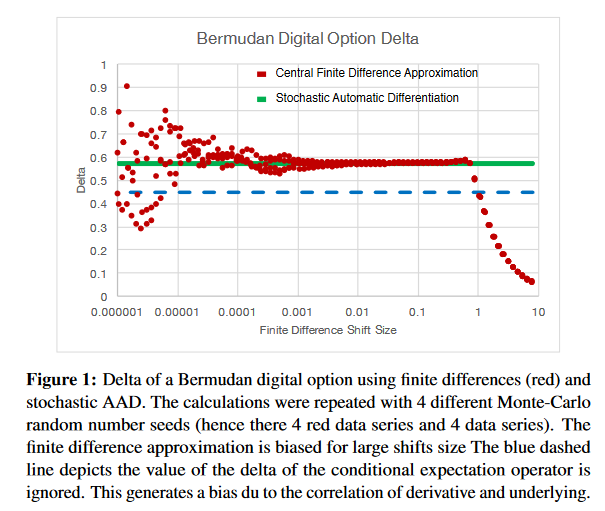

    The blue line demonstrates the bias of the standard Monte Carlo estimator for AAD and the red-dots the instability of FD. For the relation of the FD shift size (plus the amount of Monte Carlo samples) and the degree of instability, please check the descriptions within the above mentioned works. Please check the [homepage](http://christian-fries.de/finmath/stochasticautodiff/) of the author, for further reading on stochastic automatic differentiation.

 Stochastic automatic differentiation allows to investigate algorithms in the presence of stochastic operators like expectations, conditional expectations or indicator functions. The author remarks, that in special cases, when the Monte-Carlo integral of the indicator function can be replaced by an analytic function, these functions can just be differentiated by AAD - e.g. as studied in the examples above. In cases where it's infeasible to calculate the conditional expectation, the author's stochastic automatic differentiation uses a finite difference approximation which automatically decomposes the differentiation into individual contributors.

The idea of adding a stochastic node to automatic differentiation algorithms is certainly intriguing. However, for my analysis, I want to concentrate on cases involving path-wise indicators and will try to implement modifications that do not introduce any additional approximations. Specifically, I plan to use the idea of adding a stochastic node to develop a method that post-processes an AAD recording.

Taking these considerations into account, I will investigate two main topics. First, I will explore how to develop a method for post-processing AAD recordings using the concept of adding a stochastic node. Second, I will examine how to create new Monte Carlo estimators that provide stable finite difference (FD) and bias-free AAD Greeks, at least up to the second order. I will refer to these as Bias-Free Stable (BFS) Monte Carlo estimators.

## 1.1. Example: Bias-Free Stable (BFS) Monte Carlo estimators for digital and barrier options

Instead of using the standard Monte Carlo estimator for digital options, let us use a well-known transformation, see e.g. [Monte Carlo methods in financial engineering](https://link.springer.com/book/10.1007/978-0-387-21617-1) by Glasserman, that also allows for pathwise sensitivities.
Using this improved Monte Carlo estimator, we receive the following results for Delta:

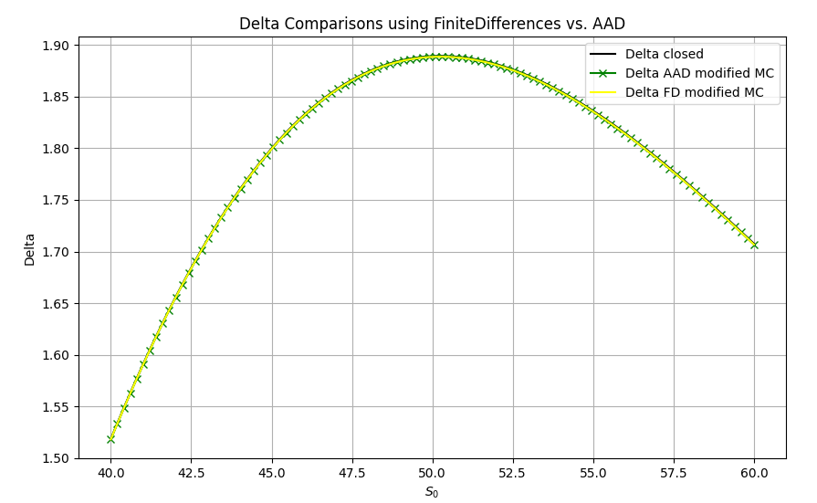

The images can be reproduced by executing the code given in this [Colab notebook](https://github.com/da-roth/StableAndBiasFreeMonteCarloGreeks/blob/main/src/Examples_Introduction/example_continued_Colab.ipynb). It's relatively easy to show that the improved Monte Carlo estimator meets the assumptions of the theorem on stable Greeks by FD formulated by Alm et al., and hence the recovered stablity of Delta by FD is not surprising. Additionally, the improved Monte Carlo estimator indeed seems to allow for bias-free AAD.

### 1.2. Example: Barrier options

While one might think the bias of above's example can be neglected, let's investigate the behaviour of FD and AAD for an up-and-out continuously-monitored barrier option call option, as a second introductional example. 

Again, for the used parameters and to re-produce the results please check the [Colab notebook](https://github.com/da-roth/StableAndBiasFreeMonteCarloGreeks/blob/main/src/Examples_Introduction/example_barrier_Colab.ipynb).

While I'll skip the investigation of the present value, the first property I'd like to point out here is as follows. Studying the results for Delta of FD and AAD of the standard Monte Carlo estimator, we obtain:

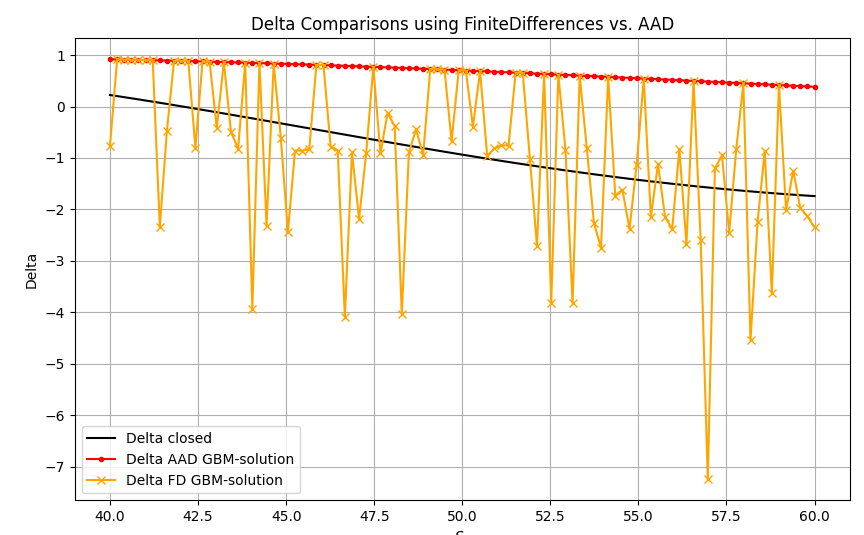

While again FD leads to instabilities, AAD is biased in such a way that for increasing initial asset values, the results have the wrong sign. The explanation is rather intuitive: While in general an increasing asset value S has positive impact on the 'vanilla' part of the payoff max(S-K,0), the AAD tool doesn't account in that an increasing asset value results in a greater knock-out probability. Hence, path that survived (not crossed the barrier), will always have positive Delta using standard AAD tools. 

For barrier options, the commonly used Brownian-bridge approach, see e.g. [here](https://arxiv.org/abs/1906.11002) and reference therein, leads to the following results for Delta:

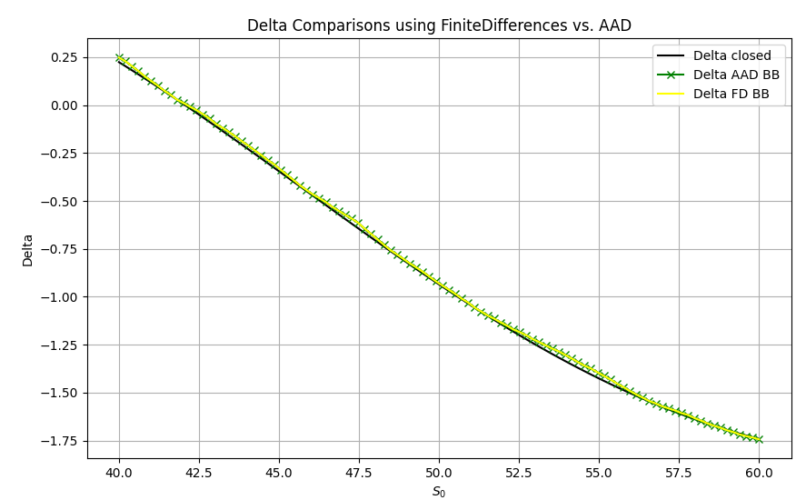

However, as investigated in ["Convergence of Milstein Brownian bridge Monte Carlo methods and stable Greeks calculation"](https://arxiv.org/abs/1906.11002), the Brownian-Bridge correction, doesn't allow for stable second-order Greeks. To get second-order Greeks through AAD, it is common to use finite differences on two evaluation of Delta. The following image, demonstrates Gamma through FD and AAD:

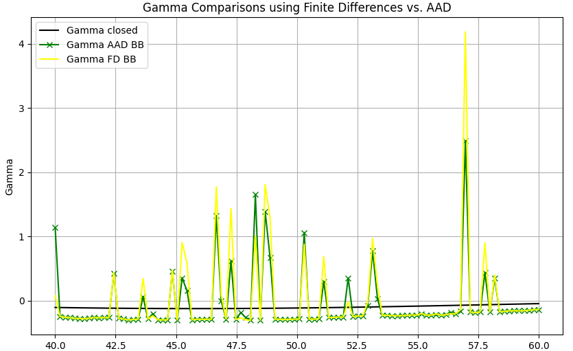

Hence, the Brownian-bridge correction, doesn't allow for stable Gamma for barrier options. Furthermore, the AAD approach (finite differences of AAD Deltas) leads to instabilities, too.

If we use the newly propsed Monte Carlo estimator of ["Convergence of Milstein Brownian bridge Monte Carlo methods and stable Greeks calculation"](https://arxiv.org/abs/1906.11002), we get the following results for Gamma:

All in all, we found a BFS Monte Carlo estimator, as demonstrated in the following:

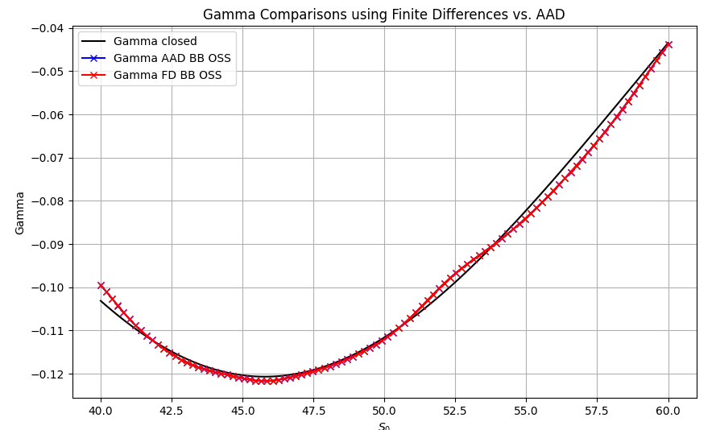

Again, see this [Colab notebook](https://github.com/da-roth/StableAndBiasFreeMonteCarloGreeks/blob/main/src/Examples_Introduction/example_barrier_Colab.ipynb) to reproduce all the results and to review the BFS Monte Carlo algorithm for barrier options.

Summary for barrier options: 
1. While the payoff of the barrier option has a discontinuity 

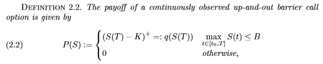

given through max(S) < B, the standard Monte Carlo estimator for this payoff would lead to instabilities (FD) and a bias (AAD). 

2. In contrast, a Monte Carlo estimator incorporating the Brownian-bridge correction, leads to stable (FD) and bias-free (AAD) first order Greeks. Furthermore, due to its construction one might also define a pathwise-sensitivities estimator, see e.g. section 7 [here](http://people.maths.ox.ac.uk/~gilesm/files/sylvestre_thesis.pdf). However, the Brownian-bridge corrected Monte Carlo estimator doesn't allow for stable (FD) nor for bias-free (AAD) Greeks, since the incorporated crossing probabilities, given by

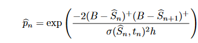

lead to a discontinuity within the first derivative, see e.g. (7.7) [here](http://people.maths.ox.ac.uk/~gilesm/files/sylvestre_thesis.pdf). 

3. As seen in above's example, the Monte Carlo estimator proposed in ["Convergence of Milstein Brownian bridge Monte Carlo methods and stable Greeks calculation"](https://arxiv.org/abs/1906.11002), which allows for stable second-order Greeks through FD, also produced bias-free Greeks through AAD. As a remark, as mentioned in the article, the estimator would also allow the usage of a pathwise sensitivities estimator, since it also got rid of the discontinuity of the first derivative. 

## 2. Relationship between stable Greeks through FD and bias-free Greeks through AAD

The example of digital and barrier options above provide a good intuition for the requirements of a Monte Carlo estimator to allow for bias-free Greeks through AAD. A simplified intuitive explanation is as follows: A Monte Carlo estimator can yield bias-free Greeks up to a certain degree if it is capable of computing these Greeks through a pathwise-sensitivity algorithm. The studies in ["Convergence of Milstein Brownian bridge Monte Carlo methods and stable Greeks calculation"](https://arxiv.org/abs/1906.11002) indicate that this is the case if the Monte Carlo estimator allows for stable Greeks through FD.

While creating the pathwise sensitivities calculator for these options can be time-consuming, it may be preferable to design the Monte Carlo estimator to allow for bias-free AAD. Then, instead of implementing the pathwise-sensitivity algorithm, one can use an unmodified AAD framework of choice.

## 3. Bias-Free Stable (BFS) Monte Carlo estimators for various financial instruments

In this section, we will take an in-depth look at specific payoffs of various financial instruments try to derive a BFS Monte Carlo estimator. 

### 3.1. Helper package plotsurfacetool

Let me introduce a lightweight Python package, that will make the investigation of the upcoming algortihms easier. Within the notebooks of section 1, all image-generating methods are also contained in the code, which makes the investigation somewhat cumbersome. The [package](https://github.com/da-roth/StableAndBiasFreeMonteCarloGreeks/tree/main/src/PlotSurfaceTool) within src/PlotSurfaceTool was also publihsed to PyPi and can just be installed using pip. It has a class PlotSettings, which allows some modifications such as finite differences step-width and wished output statistics (PV, Delta, Gamma). The PlotSettings object ist passed together with a lambda function, of the method that should be investigated, to the static method PlotSufaceTool.Run, as e.g. shown here:

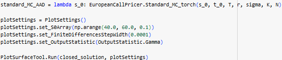

### 3.2. BFS Monte Carlo estimators

1. European options: Even for the simple European Call option, we see that the naive Monte Carlo estimator results in infeasible Gamma computation. The reason is again quite simple: The derivative of the maximum function contains an indicator function. In this case, intuitively speaking, the BFS Monte Carlo estimator can be derived by forcing the path to end above the strike price (and a proper normalization).
     
     [Colab notebook](https://github.com/da-roth/StableAndBiasFreeMonteCarloGreeks/blob/main/src/BFS_Examples/bfs_europ_call_colab.ipynb).

2. Digital options: [Colab notebook](https://github.com/da-roth/StableAndBiasFreeMonteCarloGreeks/blob/main/src/BFS_Examples/bfs_digital_colab.ipynb)

3. Barrier options: [Colab notebook](https://github.com/da-roth/StableAndBiasFreeMonteCarloGreeks/blob/main/src/BFS_Examples/bfs_barrier_colab.ipynb)

